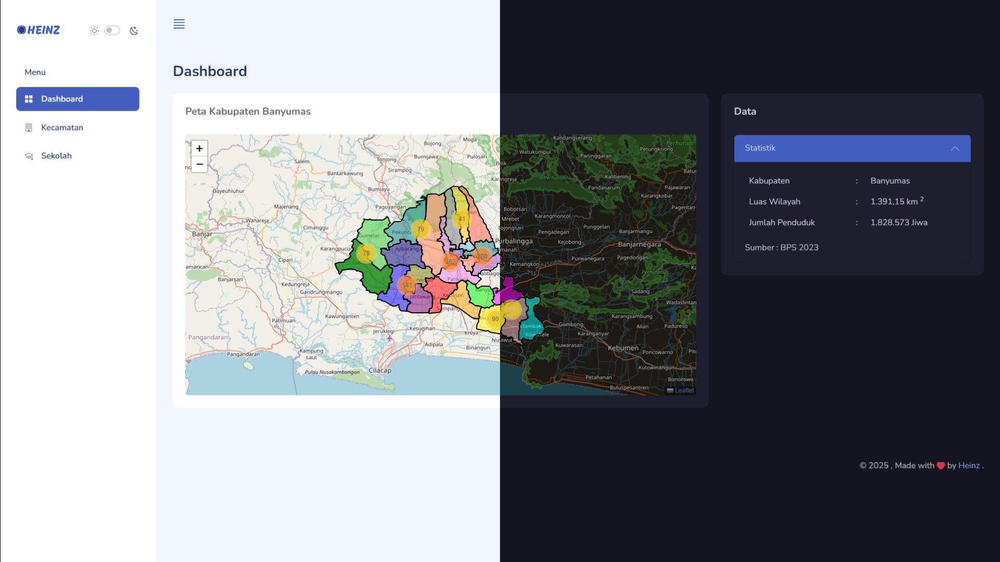

<div align="center">
  <br>
      
  <br>

  <div>
    
    
    
    
    
  </div>

<h3 align="center">Sistem Informasi Geografis</h3>
</div>

<br>

<div align="center">

[](https://sig.heinz.id/)


</div>

<br>

## Table of Content

1. [Description](#description)
2. [Features](#features)
3. [Tech Stack](#tech-stack)
4. [Quick Start](#quick-start)
5. [Environment Variables](#environment-variables)
6. [Contribution](#contribution)
7. [License](#license)

<br>

## Description

Ini adalah proyek Sistem Informasi Geografis (SIG) untuk Kabupaten Banyumas. Proyek ini dikembangkan menggunakan Laravel 11 sebagai framework backend dan LeafletJS sebagai pustaka JavaScript untuk peta interaktif.

Aplikasi ini menampilkan data spasial Kabupaten Banyumas dan memungkinkan pengguna untuk menjelajahi serta mengelola data kecamatan dan sekolah.

<br>

## Features

- Peta interaktif menggunakan LeafletJS.
- CRUD data kecamatan dan sekolah (hanya admin yang dapat mengelola data).
- Tampilan responsif menggunakan Bootstrap 5.

<br>

## Tech Stack

- **Bahasa Pemrograman**: PHP, JavaScript
- **Framework**: Laravel 11
- **Library Pemetaan**: LeafletJS
- **Basis Data**: MySQL
- **CSS Framework**: Bootstrap 5

<br>

## Quick Start

**Prerequisites**:\
Ikuti langkah-langkah di bawah ini untuk menginstal dan menyiapkan semua prasyarat:

**Laragon**\
Pastikan Laragon sudah terinstal dan berjalan di komputer Anda. PHP Versi 8.2 atau lebih tinggi harus diperlukan untuk Laravel 11.

**Nodejs**\
Pastikan Node.js sudah terinstal dan berjalan di komputer Anda. Jika Anda sudah menginstal Node di komputer Anda, Anda dapat melewati langkah ini jika versi Node yang Anda miliki lebih dari 18. Kami menyarankan Anda untuk menggunakan versi LTS dari Node.js.

**Composer**\
Pastikan Composer telah terinstal dan berjalan di komputer Anda. pastikan versi composer adalah 2.2.0 atau lebih tinggi.

**Git**\
Pastikan Git terinstal secara global dan berjalan di komputer Anda. Jika Anda sudah menginstal git di komputer Anda, Anda dapat melewati langkah ini.

Setelah semua prasyarat terpasang, Anda dapat melanjutkan ke langkah-langkah berikut untuk memulai proyek Anda:

1.  **Clone Repositori**:

    ```bash
    git clone https://github.com/demonicheinz/gis-app.git
    cd gis-app
    ```

2.  **Install Dependensi**:

    ```bash
    composer install
    ```

3.  Install and Build Node.js Dependencies

    ```bash
    npm install && npm run build
    ```

4.  Konfigurasi File `.env`

    Salin file `.env.example` menjadi `.env` dan atur konfigurasinya:

    ```bash
    cp .env.example .env
    ```

5.  **Generate Key Aplikasi**:

    ```bash
    php artisan key:generate
    ```

6.  **Jalankan Migrasi**:

    ```bash
    php artisan migrate --seed
    ```

7.  **Jalankan Aplikasi**:

    ```bash
    php artisan serve
    ```

    Untuk menjalankan aplikasi frontend, jalankan:

    ```bash
    npm run dev
    ```

8.  **Buka Aplikasi di browser**:

    ```
    http://localhost:8000
    ```

<br>

## Environment Variables

Pastikan file .env telah diisi dengan variabel berikut:

<details>
<summary><code>.env</code></summary>

```env
APP_NAME="SIG Banyumas"
DB_DATABASE=gis_app
DB_USERNAME=root
DB_PASSWORD=
MAIL_MAILER=smtp
MAIL_HOST=smtp.example.com
MAIL_PORT=587
MAIL_USERNAME=your-email@example.com
MAIL_PASSWORD=your-password
```

</details>

<br>

## Contribution

Jika Anda ingin berkontribusi pada proyek ini, silakan fork repositori ini dan ajukan pull request. Kami menerima berbagai bentuk kontribusi seperti penambahan fitur, perbaikan bug, dan dokumentasi.

<br>

## License

Proyek ini dilisensikan di bawah lisensi MIT - lihat file LICENSE untuk detail lebih lanjut.

<br>
